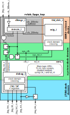

.. _`clocks_resets`:

Clocks and Resets
=================

The following diagram gives an overview over the clocks that resets that are present in the system.

   rvlab_fpga_top clock & reset diagram

**The system's main logic** (CPU, TL-UL bus, student module) are clocked by the system clock (sys_clk connected to clk_i) and are reset asynchronously by the system reset (sys_rst_n connected to rst_ni). The system clock is generated by a on-chip multi-mode clock manager (MMCM) and has a frequency of **50 MHz**.

The MMCM is driven by an external 100 MHz crystal oscillator.

The RISC-V debug logic can reset the system clock domain using its **ndmreset** signal (non-debug-module reset). The RISC-V debug logic itself is reset by a separate signal **dbg_rst_n**, excluding itself from such an ndmreset.

Bitstream loading initializes the synchronization flip-flops in the system clock domain with asserted reset signals. sys_rst_n and dbg_rst_n are deasserted when the external system-reset signal **jtag_srst_ni** is deasserted and the MMCM clocks are ready (locked). Strictly speaking, jtag_srst_ni is not a JTAG signal, but it is connected to the FT2232H chip that also drives the JTAG signals. The mechanical reset button is not connected to any reset.

Multi-FF Synchronizers
----------------------

Synchronizer flip-flops at clock domain crossings should be marked with :code:`(* ASYNC_REG = "TRUE" *)` in Verilog. This causes them to be treated differently during synthesis and simulation. Most importantly, timing violations at flip-flops marked as *ASYNC_REG* do not lead to X values in simulation. Vivado does this by setting the XON parameter of the flip-flop (e.g. FDCE) to FALSE. No additional XDC constations are needed. Details are described in UG912 (see :ref:`resources`).

The setup/hold violations are still printed by the simulator, even though they do not result in X values.

The *prim_flop_2sync* module uses the *ASYNC_TRUE* property as described.