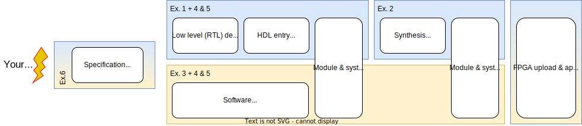
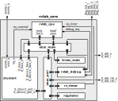

# **RISC-V Lab**
# Ex1: Introduction


---
# **Content**
1. Organisation
2. Project overview
3. Exercise 1: HDL Entry & Simulation
4. Group registration

---
# **Organisation**
- **4** students per team
- `project`: **self defined** HW (FPGA) / SW (RISC-V)  
  e.g.: real time video & audio, many-core X, networking...

## **Formals**
- module = lecture + project
- 6 ECTS (<=> *27.5h / 12 lecture weeks = 14h/week) 
- project ET / CS 
- see module description for exam details

---
## **(To) Do's**
1. 6 assignments **completed in time** (=one week, deadline 2 weeks)
  walk you through the design flow & build base of your project
2. your project's **self specified** functionality demonstrated **on FPGA**
3. **take part** in mid- and final presentations (incl. video clip)
4. project specification & documentation
   ("on the go", effort minimized)

---
## **Support**
- `rvlab/doc/_build/html/index.html` !!
  `/home/rvlab/docs/index.html`
- IT (workstations, EDA tools, licenses .. )
  - Adela Westedt: adela.westedt@tu-berlin.de, 24248, EN435a 
  - Rene Hartman: rene.hartmann@tu-berlin.de, 25351, EN435a
- Marco Liem: marco.liem@campus.tu-berlin.de (-> ZOOM)
- Tobias Kaiser: kaiser@tu-berlin.de, 25561, EN411

---
# **Rvlab Overview**
## **Flow (simple)**


### Simulation is king !
### (not PCB tinkering)

---
## **Rvlab Flow**


---
## **Rvlab System**


---
## **Rvlab Core**


---
# **Exercise 1: HDL Entry & Simulation**


---
## **Register bus read**


```verilog
localparam logic [3:0] ADDR_REGA = 4'h0;
localparam logic [3:0] ADDR_REGB = 4'h4;
logic [31:0] regA;
logic [ 7:0] regB;
always_comb begin
  rdata = '0;  // !!!
  case (addr)
    ADDR_REGA:  rdata[31:0] = regA;
    ADDR_REGB:  rdata[ 7:0] = regB;
    default:    rdata       = '0;
  endcase
end
```

---
## **Register bus write**


```verilog
always_ff @(posedge clk_i, negedge rst_ni) begin
  if (~rst_ni) begin
    regA   <= 32'h0000AFFE; // reset value
    regB   <= '0;           // reset value
  end else begin
    if (we) begin
      case (addr)
        ADDR_REGA: regA <= wdata[31:0];
        ADDR_REGB: regB <= wdata[ 7:0];
        default: ;
      endcase
    end // if(we)
  end // if (~rst_ni) else
end 
```

---
## **Demo FSM**


```verilog
  enum logic[1:0] {idle, swap, count} state;
  logic [7:0] led;
  logic [1:0] cnt;
  always_ff @(posedge clk_i, negedge rst_ni) begin
    if (~rst_ni) begin
      state   <= idle;
      led     <= 8'b10101010;
      cnt     <= '0;
    end else begin
        case (state)
          idle: begin
            if (regB[0] == 1'b1) begin
              led   <= regA[15:8];
              state <= swap;
            end
          end
          swap: begin
            led[7:4] <= led[3:0];
            led[3:0] <= led[7:4];
            cnt      <= 2'd2;
            state    <= count;
          end
          count: begin
            if (cnt != 0) begin
              cnt <= cnt - 1;
            end
            else begin 
              state <= idle;
            end
          end
          default: state <= idle;
        endcase;
    end // if (~rst_ni) else
  end 
```

---
## **RTL Simulation with Questa Sim**
- Inputs
  - RTL design in *synthesisable* HDL
  - test bench in HDL
  - tcl scripts: wave view formatting (.do), ...
- Outputs
  - value trace of all signals
  - messages from display$()

`flow student_rlight_tb.sim_rtl_questa`

---
# **Hints for Ex.1**
- address space ("registers") != physical registers
- handle conflicting writes (HW vs. SW)!
  Suggestions !


---
# **Group registration & 1st login**
1. **Self organize** groups of 4 students each
2. Each group comes forward & registers
3. Each group receives one account for the msc network
   user: rvlab[01-20] / password: 
4. Walk to EN4141 / Door code: 
   or 
   i) connect to TUBIT VPN
   ii) log in using [wiki.x2go.org](wiki.x2go.org)
   iii) X2GO server: msclab.msc.tu-berlin.de, desktop: XFCE
5. Change password immediately: `passwd`
Detailed instructions for X2GO on ISIS page.

---
# **Getting rvlab**
1. Log into the msc network using your rvlab?? account.
2. Clone the git using your TUBIT account:
   `git clone https://git.tu-berlin.de/msc/rvlab`  
3. Start with the 1st exercise sheet:
   `firefox /home/rvlab/docs/index.html`

*(No support: If you want to run rvlab on your own machine see rvlab/README.rst.)*

---
# **Appendix**
**Kill a dead session on the server**
1. ssh on the server
2. `x2golistsessions` to list your running sessions and get their ID
It will return a string, e.g. 494|slehmann-62-1536514901_stDXFCE_dp24|62|mscx2go|...
The second field is the session ID e.g. "slehmann-62-1536514901_stDXFCE_dp24"
3. `x2goterminate-session slehmann-62-1536514901_stDXFCE_dp24`
