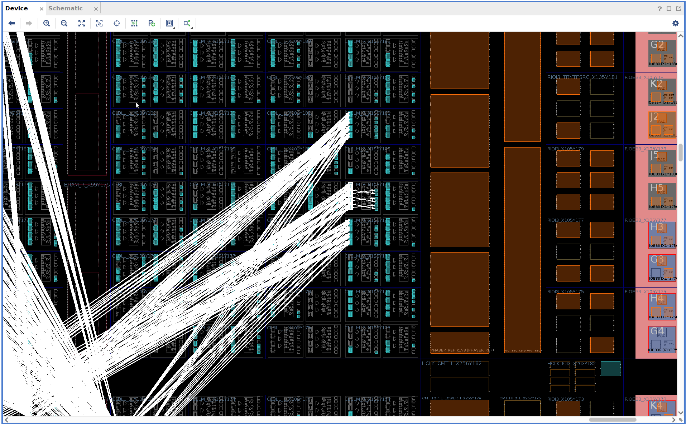
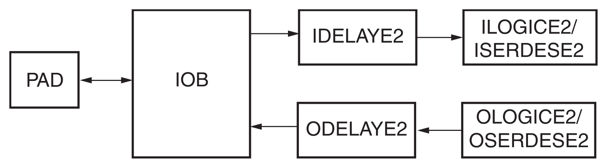
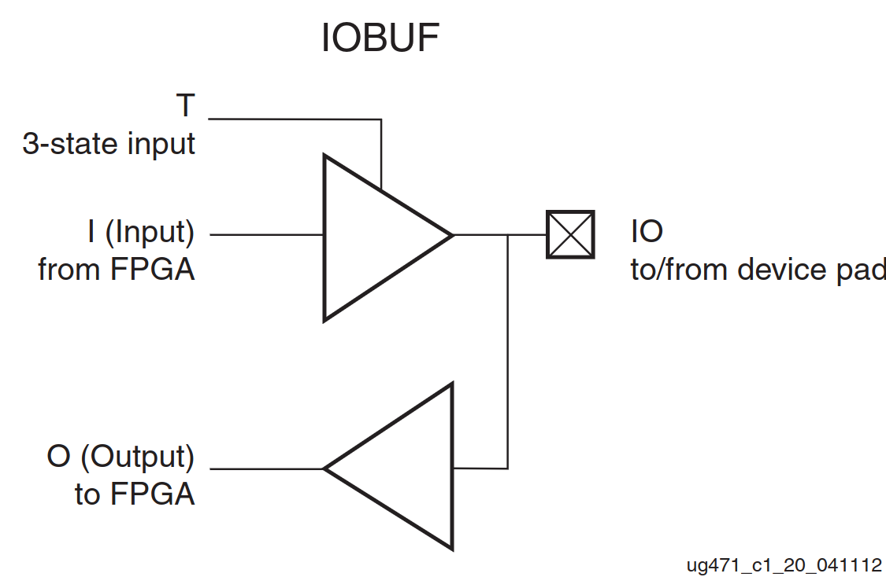
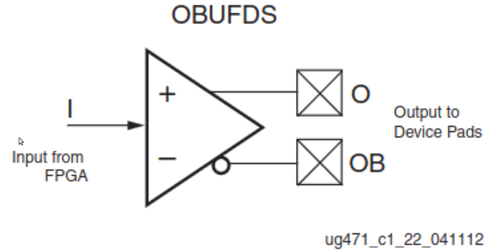
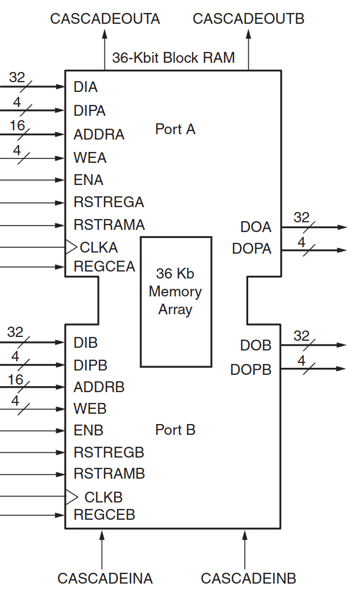
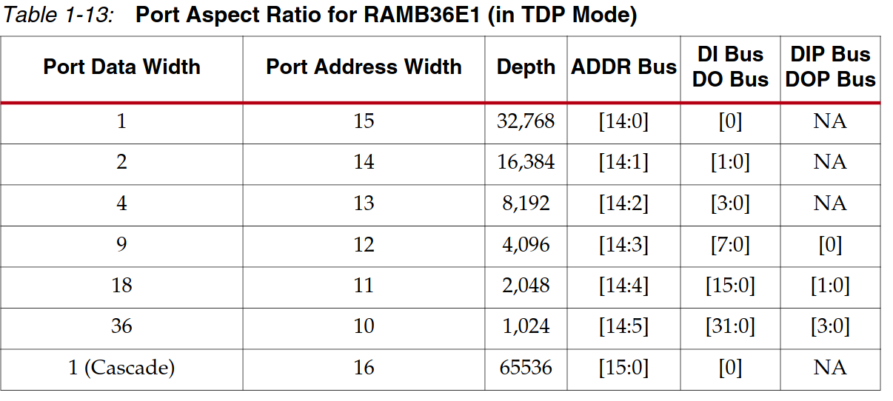

# **RISC-V Lab**
# Ex2: FPGA Protoyping


---
# **Content**
1. Xilinx Series 7 (condensed)

2. FPGA design flow

3. Netlist simulation

---
# **Xilinx Series 7 (condensed)**
## **Overview**


*from/overview: "7 Series FPGAs Data Sheet: Overview DS180 (v2.6.1) September 8, 2020"*

---
## **IO Tile**

* PAD: metal window 
* IOB (IO Buffer): physical driver / receiver (logic <-> world)
* IDELAY2 / ODLEAY2 : programmable delays
  e.g. for data line delay matching
* I/OLOGIC I/OSERDES: fast shift registers, ...

---
## **IO Tile: IO Buffers**


* IOBUF
  * on PCB set to 3.3V (!)
```
T  I  O      IO
0  0  IO     0
0  1  IO     1
1  *  Z/IO   Z/IO
Note: rvlab wrapper inverts T !
```
* IBUFDS / OBUFDS (HDMI)
* 
*from/details: "7 Series FPGAs SelectIO Resources User Guide (UG471)"*

---
## **Slice**

- basic block for all logic!
- 4x 6 input or 8x 5 input LUT 
- 8x D-FF
- add/sub: CR / 4 bit CLA 
- (output) muxing
- alternatively: 32 / 2x16 bit shift register or 64bit RAM
- 1 CLB (configurable logic block) = 2 * slices

---
## **Slice: consequences**

=> efficient logic should fit into a slice (-> no slow routing)
(add / sub can span multiple slices due to dedicated CR lines)

Questions
- Q1: What is the maximum 1:N Mux for a **4** input LUT ?
- Q2: How many % of a 6 input LUT does the function  ~(a & ~b | c) occupy ? 

*from / details: "7 Series FPGAs Configurable Logic Block User Guide UG474 (v1.8) September 27, 2016"*

---
## **Hardcores**
- DSP
  - 25x18 multiplier ---
  - use cases: (adaptive) filters (FIR), FFT, ...
  - XC7A200T: 740
- PLLs / Mixed-Mode Clock Manager
  - frequency multiplication M/N
  - phase shift
  - N phase output (e.g. for high resolution PWMs)
- GBit Transceiver, PCIe, ...

---
## **Hardcores: Block rams (1)**

- synchronous read & write
- true dual port
- 1x 36kb or 2x 18kb
- aspect ratio configurable
- cascade: 2x32kx1 => 64kx1
- XC7A200T: 365 (13140 Kbit)

---
## **Hardcores: Block rams (2)**

*from / details: "7 Series FPGAs Memory Resources User Guide UG473 (v1.14) July 3, 2019"*

---
## **How to Use**
1. automatic inference by synthesis (preferred) 

2. if synthesis fails instantiate "primitive*"Vivado Design Suite 7 Series FPGA and Zynq-7000 SoC Libraries Guide UG953 (v2021.2) October 22, 2021"*" from library
 - DSP slices (esp. MAC, mul always works)

3. instantiate "primitives" from library
  - Block rams (try synthesis, but keep checking !)
  - (global) buffers / routing ressources (BUGF, BUGH, ...)
  - IOs (already provided in rvlab)
  - PLLs

---
## **How to Use: Example**

```Verilog
module iocell_bidir #(
    parameter int Width = 1
) (
  inout  wire  [Width-1:0] pad,
  input  logic [Width-1:0] oe,
  input  logic [Width-1:0] out,
  output logic [Width-1:0] in
);
  generate
    genvar i;
    for (i = 0; i < Width; i++) begin : cellarray
      IOBUF #(
        .DRIVE       (4),
        .IBUF_LOW_PWR("TRUE"),
        .IOSTANDARD  ("DEFAULT"),
        .SLEW        ("SLOW")
      ) iocell (
        .O (in[i]),   // Buffer output
        .IO(pad[i]),  // Buffer inout port (connect directly to top-level port)
        .I (out[i]),  // Buffer input
        .T (~oe[i])   // 3-state enable input, high=input, low=output
      );
    end
  endgenerate
endmodule
```
---
## **How to Use (2)**
Instance templates are in the: *"Vivado Design Suite 7 Series FPGA and Zynq-7000 SoC Libraries Guide UG953 (v2021.2) October 22, 2021"* (see Resources)

---
## **Hardware O(n)**
+C, -C, +1, -1, +,-,*, /, <<, >>, |, &, ~, 1:N mux, M:N mux, sin,cos, >=, <=, ==

O(k):

O(n):

O(N log N):

O(N^2):

don't use: 

---
# **FPGA Design Flow**


---
# **Netlist simulation**

---
