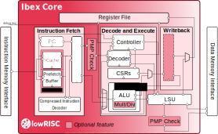

# **RISC-V Lab**
# Ex3: Software


---
# **Content**
1. RISC-V Principles
2. IBEX CPU
3. SW structure & flow
4. Register definitions
5. ANSI C for hardware

---
# **RISC(-V): Principles**
  * load / store architecture (memory access separate from compute)
  * 31 orthogonal registers x1-x32 (x0 is *zero*)
  * **few** (>=39) & **simple** instructions
    * 3 operand instructions: `add x1,x2,x3` x1 = x2 + x4
    * 2 operand + immediate: `addi x1,x2,0x42` x1 = x2 + 0x42
  * 3 addressing modes (only!)
    * data: reg+off: `sw x4,4(x3)` Mem[x3+4] = x4
    * PC: PC relative: `jal main` rd = PC+4; PC=PC+imm
    * data: "absolute": `lui x3,0xAFFE` x3 = im << 12
  * fixed instruction length (almost)

---
# **RISC-V: Notables**
* extensible: standardized & custom extensions
* combined compare & branch instruction
  `blt x1, x2, end` PC += 4 + (x1<x2) ? imm:0 
  -> no status flags (carry, zero, negative...)
* control and status registers (CSR)
  * part of privileged specification (for OS, IO)
  * rvlab: mstatus, mie, mscratch (explained by example)

*lots more, for details see "The RISC-V Instruction Set Manual"*

---
# **IBEX CPU**


* ISA: RV32IMC
  (more per cfg)
* 2 or 3 stage pipeline
  -> PC is ahead!
* harvard architecture
  (rvlab joins address spaces in TL-UL crossbar)
* M / U mode

---
# **Software structure**

* crt0.S: startup code in assembly
* baselib
  * clib
  * hostio: stdio <-> memory <-> JTAG  
* Hardware Abstraction Layer

---
# **SW flow**
TODO: diagram_flow

---
# **Linker Script**
```mipsasm
OUTPUT_ARCH( "riscv" )
ENTRY(_start)

SECTIONS
{
  . = 0x00000000;

  .text.boot : { *(.text.boot) } 

  . = 0x400;
  .text.lib : { *libc.a:*(.text .text.*) }
  .data.lib : { *libc.a:*(.data .data.* .rodata .rodata.* .sdata .sdata.* .srodata .srodata.*) }
  .bss.lib : { *libc.a:*(.bss .eh_frame .sbss) }


  .text : { *(.text .text.*) }
  .data : { *(.data .data.* .rodata .rodata.* .sdata .sdata.* .srodata .srodata.*)  }

  /* _memory_init_start = .; */

  .bss : { *(.bss .eh_frame .sbss) }
  _main_stack_top = 0x00038000;
  _irq_stack_top = 0x0003F000;
  hostio = 0x0003F000;
}
```
