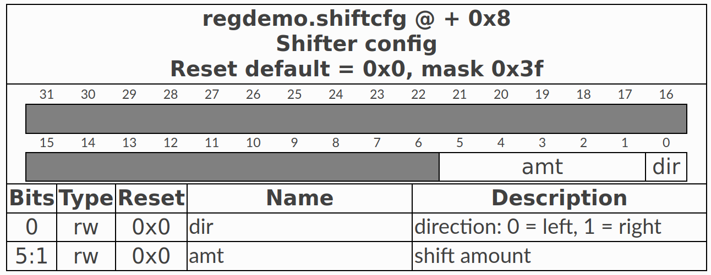
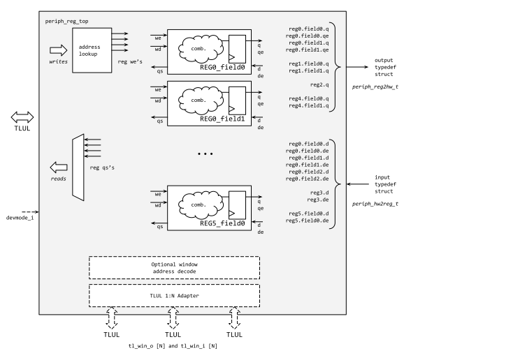
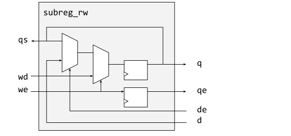
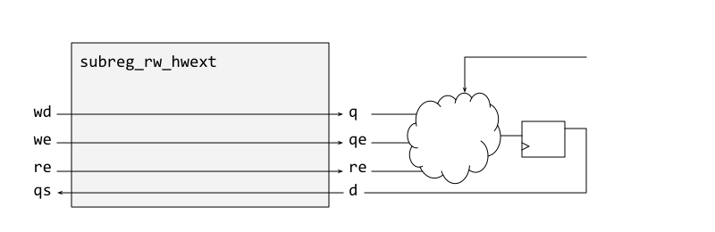

# **RISC-V Lab**
# Ex3: Software


---
# **Content**
1. RISC-V ISA
2. IBEX CPU
3. SW structure & flow
4. Register Tool
5. HAL Drivers
6. ANSI-C Traps & Pitfalls

---
# **RISC(-V): Principles**
* load / store architecture (memory access separate from compute)
* 31 orthogonal registers x1-x32 (x0 is *zero*)
* **few** (>=38) & **simple** instructions
  * 3 operand instructions: `add x1,x2,x3` x1 = x2 + x4
  * 2 operand + immediate: `addi x1,x2,0x42` x1 = x2 + 0x42
* 3 addressing modes (only!)
  * data: reg+off: `sw x4,4(x3)` Mem[x3+4] = x4
  * PC: PC relative: `jal main` rd = PC+4; PC=PC+imm
  * data: "absolute": `lui x3,0xAFFE` x3 = im << 12
* fixed instruction length (almost)

---
## **RISC-V: Notables**
* extensible: standardized & custom extensions
* no status flags (carry, zero, negative...)
  * combined compare & branch instruction
    `blt x1, x2, end` PC += 4 + (x1<x2) ? imm:0 
  * add with carry replaced by 
    `slt x1,x2,x3` x1 = (x2<x3) ? 1 : 0
* lots more

<!--
---
## **RISC-V: (Un)privileged**
* previous slides covered "Unprivileged ISA" 
  (= alwas applicable, regardless of e.g. mode)
* "Privileged ISA" - adds functionality for OS & IO
  * much more complex than ISA

Parts of "Privileged ISA" used in rvlab
* control and status registers (CSR) (below &  ex5) 
* traps & irqs (-> ex5)
-->

---
# **IBEX CPU**


* ISA: RV32IMC
  (more per cfg)
* 2 or 3 stage pipeline
  -> PC is ahead!
* harvard architecture
  (rvlab joins address spaces in TL-UL crossbar)
* M & User modes

---
# **SW structure**

* crt0.S: startup code in ASM
  creates environment for C 
* baselib
  * clib
  * hostio:
    stdio <-> mem <-> JTAG  
* Hardware Abstraction Layer (HAL)
* application
---
# **SW flow**


---
# **Linker Script**
```mipsasm
OUTPUT_ARCH( "riscv" )
ENTRY(_start)

SECTIONS
{
  . = 0x00000000;

  .text.boot : { *(.text.boot) } 

  . = 0x400;
  .text.lib : { *libc.a:*(.text .text.*) }
  .data.lib : { *libc.a:*(.data .data.* .rodata .rodata.* .sdata .sdata.* .srodata .srodata.*) }
  .bss.lib : { *libc.a:*(.bss .eh_frame .sbss) }


  .text : { *(.text .text.*) }
  .data : { *(.data .data.* .rodata .rodata.* .sdata .sdata.* .srodata .srodata.*)  }

  /* _memory_init_start = .; */

  .bss : { *(.bss .eh_frame .sbss) }
  _main_stack_top = 0x00038000;
  _irq_stack_top = 0x0003F000;
  hostio = 0x0003F000;
}
```
---
# **Register Generator**
* Issues
  * SW & HW developed concurrently => registers will change
  * **same** register information replicated in doc, HDL, C
   => mismatch guaranteed
* Solution: Opentitan's reggen
  * *single* basis for all descriptions
  * Hjson -> (Html, System Verilog, C)

---
## **Reggen: Html**


---
## **Reggen: JSON**
```JSON
  name: "regdemo"
  clock_primary: "sys_clk"
  bus_device: "tlul"
  regwidth: "32"
  registers: [
    //  2 more regs (0x0, 0x4) omitted here 
    {
      name: "shiftcfg"
      desc: "Shifter config"
      swaccess: "rw"            //  rw  ro  wo
      hwaccess: "hro"           // hrw hro hwo
      // hwext: "true"          // true -> generate decoder only
      // hwqe : "true"          // true -> generate write strobe qe
      // hwre : "true"          // true -> generate read strobe  re 
      fields:
      [
        {bits: "5:1", name: "amt", desc: "shift amount"}
        {bits: "0", name: "dir", desc: "direction: 0 = left, 1 = right"}
      ]
    }
  ]
```
---
## **Reggen: HW top**


contains:
tlul_adapter_reg

replaces:
write block
read block

---
## **Reggen: HW bitfields**



* left side controlled by SW (via tul_adapter_reg)
* right side controlled by *your* HW
  * q : data in reg
  * qe: 1<->SW has written
  * re: 1<->SW is read
  * d: HW write data
  * de: 1<->HW writes data

---
## **Reggen: System Verilog - package**
```Verilog
package regdemo_reg_pkg;
// ...
typedef struct packed {
    struct packed {
      logic        q;
    } dir;
    struct packed {
      logic [4:0]  q;
    } amt;
  } regdemo_reg2hw_shiftcfg_reg_t;
// ...
  // Register to internal design logic
  typedef struct packed {
    regdemo_reg2hw_shiftin_reg_t shiftin; // [38:7]
    regdemo_reg2hw_shiftcfg_reg_t shiftcfg; // [6:1]
  } regdemo_reg2hw_t;

  // Internal design logic to register
  typedef struct packed {
    regdemo_hw2reg_shiftout_reg_t shiftout; // [31:32]
  } regdemo_hw2reg_t;
//...
```
---
## **Reggen: System Verilog - module**
```Verilog
module regdemo_reg_top (
  input clk_i,
  input rst_ni,

  // Below Regster interface can be changed
  input  tlul_pkg::tl_h2d_t tl_i,
  output tlul_pkg::tl_d2h_t tl_o,
  // To HW
  output regdemo_reg_pkg::regdemo_reg2hw_t reg2hw, // Write
  input  regdemo_reg_pkg::regdemo_hw2reg_t hw2reg, // Read

  // Config
  input devmode_i // If 1, explicit error return for unmapped register access
);
```

---
## **Reggen: C**
```C
// reggen/regdemo.h  (generated)
#define REGDEMO_SHIFTCFG(id)           (REGDEMO ## id ## _BASE_ADDR  + 0x8)
#define REGDEMO_SHIFTCFG_OFFSET        0x8
# define REGDEMO_SHIFTCFG_DIR_LSB      0x0
# define REGDEMO_SHIFTCFG_DIR_MASK     0x1
# define REGDEMO_SHIFTCFG_DIR_SIZE     0x1
# define REGDEMO_SHIFTCFG_DIR_DEFAULT  0x0
# define REGDEMO_SHIFTCFG_AMT_LSB      0x1
# define REGDEMO_SHIFTCFG_AMT_MASK     0x1f
# define REGDEMO_SHIFTCFG_AMT_SIZE     0x5
# define REGDEMO_SHIFTCFG_AMT_DEFAULT  0x0
```
```C
// rvlab.h (manually written)
#include "reggen/regdemo.h"
#define REGDEMO0_BASE_ADDR 0x1f002000
```
---
## **Reggen: C usage**
```C
// write shiftcfg
REG32(REGDEMO_SHIFTCFG(0)) = (5<<REGDEMO_SHIFTCFG_AMT_LSB) | 
                             (1<<REGDEMO_SHIFTCFG_DIR_LSB);

// read shiftcfg
shiftcfg = REG32(REGDEMO_SHIFTCFG(0));
dir = (shiftcfg >> REGDEMO_SHIFTCFG_DIR_LSB) & 
      REGDEMO_SHIFTCFG_DIR_MASK;
amt = (shiftcfg >> REGDEMO_SHIFTCFG_AMT_LSB) &
      REGDEMO_SHIFTCFG_AMT_MASK;
```

---
# **HAL Drivers**
* Goal: Maximal *"information hiding"* (implementation details of your HW) for maximum *orthogonality*:
  - all register accesses
  - HW specific constants (like clock frequency, ...)
  - conversions
...

---
## **HAL: Example Lauflicht**
```C
/** Set/Get mode (0:right, 1:left, 2:ping_pong) */
void ll_set_mode(unsigend int mode) ;
unsigend int  ll_get_mode() ;

/** Set/Get pause in clock cycles */
void ll_set_pause(unsigend int pause) ;
unsigend int  ll_get_pause() ;

/** Set / get pattern (LEDs right aligned) */
void ll_set_pattern(unsigend int pattern) ; 
unsigend int  ll_get_pattern() ;
```
**Improve !**

---
# ANSI C for HW

```C
// absolute values in enums
enum modes {half=0x01234567, full=(int)0x89ABCDEF } ;
```

```C
// variable at absolute address
volatile unsigned int *lauflicht_reg0 = (unsigned int *)adr_lauflicht_reg0 ;
*lauflicht_reg0 = 0x01234567 ;
a = *lauflicht_reg0 ; 
```

```C
#define REG8(addr) *((volatile uint8_t *)(addr))
#define REG16(addr) *((volatile uint16_t *)(addr))
#define REG32(addr) *((volatile uint32_t *)(addr))
```
