# **RISC-V Lab**
# Ex4: On Chip Interconnects

---
# **Content**
1. Basics
2. Pipelining
3. Decouple
4. Topologies
5. Multi Master
6. Implementation
7. Examples

---
# **Basics**
* requirement: *exchange data* between N on chip components.
  * issues: on chip delays, O(N²) for full orthogonality
  * performance metrics: throughput & latency
* **common logical model** of all components: hardware resources (registers, memory) mapped into "flat" address space
* primarily standardized **interface**, not topology
* maximizes **reuse** ("lego") of
  * know how
  * modules
  * test, debugging & profiling infrastructure

---
## **Basics: Nodes**
Classes of nodes
* master / host: initiates transfer
* slave / device: determines speed of transfer

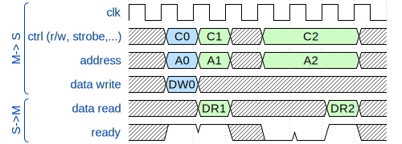

Slave can stop a transfer anytime (ready, ack ...)
=> master / OCI blocked
=> loss of throughput (& latency)

---
# **Prevent blockade of master & OCI**

1. Master provides additional information to the slave
   e.g. amount & addresses next ("burst" access)

2. Split transfer
Master releases bus for new transfers during the wait period and the transfer is resumed later (often not feasible / too complex)

3. Pipelining

4. Decouple request from action (read/write)   
   -> message based (NoC)

---
## **Pipelining**
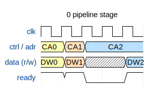

**0 pipeline stages**
  - 0..1 transfers in flight
  - latency: 0 cycles
  - combinational loop
    master -> slave -> master 
    (adr/ctrl -> "ready" / data(r)

---
## **Pipelining**
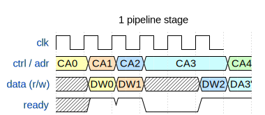

**1 pipeline stage**
  - 0..2 transfers in flight
  - latency: 0 cycle
  - hold by slaves holds the *next* transfer

**1 read / 0 write pipeline stages**
  - used by SPSRAM

---

### **Pipelining: Conversion 1r/0w -> 1r/1w**

---
## **Pipelining: 2 stages**
* very complex (esp. crossbars)
* for some cases 
  - too long (e.g. CPU 2 SRAM)
  - too short (e.g. CPU 2 far away peripheral)

=> need "variable" pipeline depth

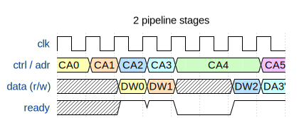

---
## **Decouple**
**decouple action (read/write) from bus transaction**
* "bus read/write" => request message + response message
* independent channels for request & response
* handshaking for messages, not actions

=> bus latencies do not impact throughput
=> 0..∞ simultaneous transactions

Examples
* ARM AMBA **AXI** (Advanced eXtensible Interface)
* Tile Link

---
## **Decouple: TL-UL: a channel**
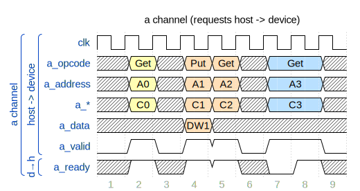

---
## **Decouple: TL-UL: d channel**
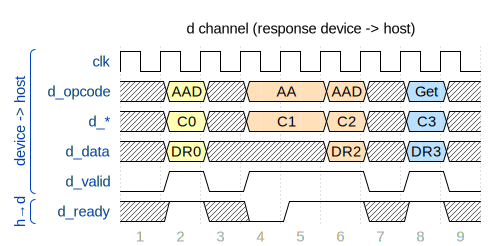

---
## **Decouple: TL-UL: Rules**
* goal: prevent deadlock & combinational loop
* "4.1 Flow Control Rules"
  - valid must never depend on ready
    (no comb. path from ready to any control / data signal)
  - ...
* "4.2 Deadlock Freedom"
  - prio(response) > prio(request)
  - ...

Please read the TL-UL specification!

---
# **Topologies: Extremes**

Topology           | connections  | simultaneous| comment
-------------------|--------------|-------------|-------------
(shared) bus       |  M:S, 1:S    | 1           | e.g. (legacy) PCB
crossbar / switch  |    M:S       | min(M,S)    | completely connected
point 2 point      |    1:1       | 1           | 

---
## **Topologies: Hierarchical**
* many intermediates topologies: ring, cube  , ...
* hierarchical structures using (sparse) crossbars
  * sparse = subset of (M,S)
  * extremes: 1:N ("bus"), M:1 

---
## **Toplogies: Examples**
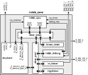
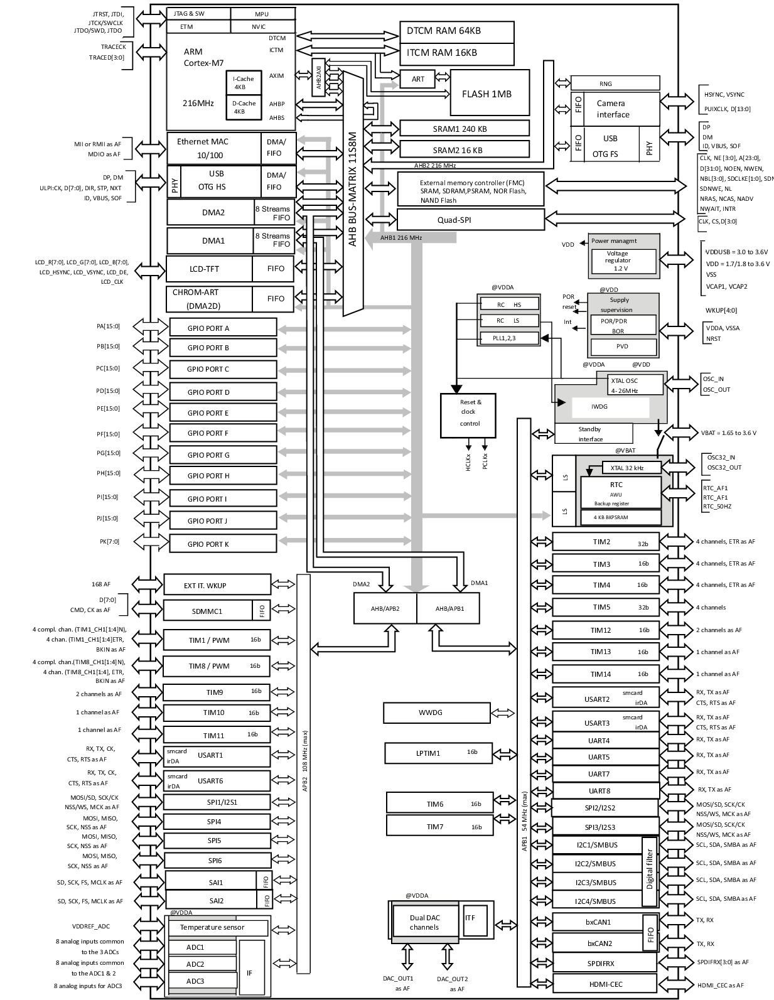

---
# **Single Master**

1. PERI -> CPU
2. /3. (CPU <-> RAM)
4. CPU -> PERI

* **every** word moved by the CPU at least twice
* interconnect latency to peri directly slows down  CPU

Ex.: SPI without DMA handled by 400 MHz R7 ARM in an SoC ⇒<20 Mbit  

---
# **Multi Master**
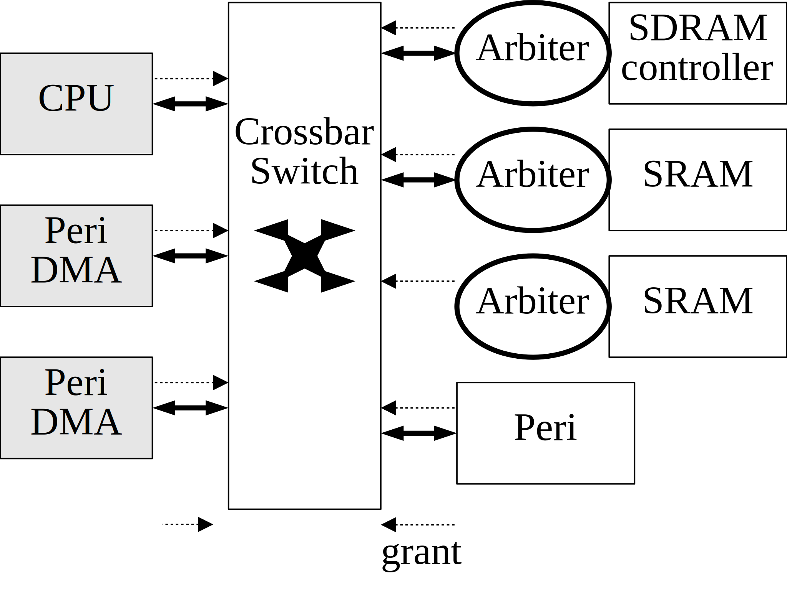
1. peri -> RAM
2. CPU switches pointers
3. RAM -> peri

* peri works on (complex) data structures (e.g.  descriptors, linked lists, instructions)
* CPU works in parallel
* interconnect latency to peri hidden from CPU  

---
## **Implementation: Tristate**

* lines (data, address, ...) used bidirectionaly
* used in: PCB design  
  - orders of magnitude fewer components
  - limits on package pin count and routing
  - mostly for medium (SQI, PSRAM) to slow (I2C) components 
* on chip: **=> Tristate not suitable.** 
  - limitations order of magnitude higher
  - high design effort,  (e.g. 2 phase clk, asyn. delays, bus holders ...) 
  -  not supported by EDA tools 

---
## **Implementation: Multiplexed**
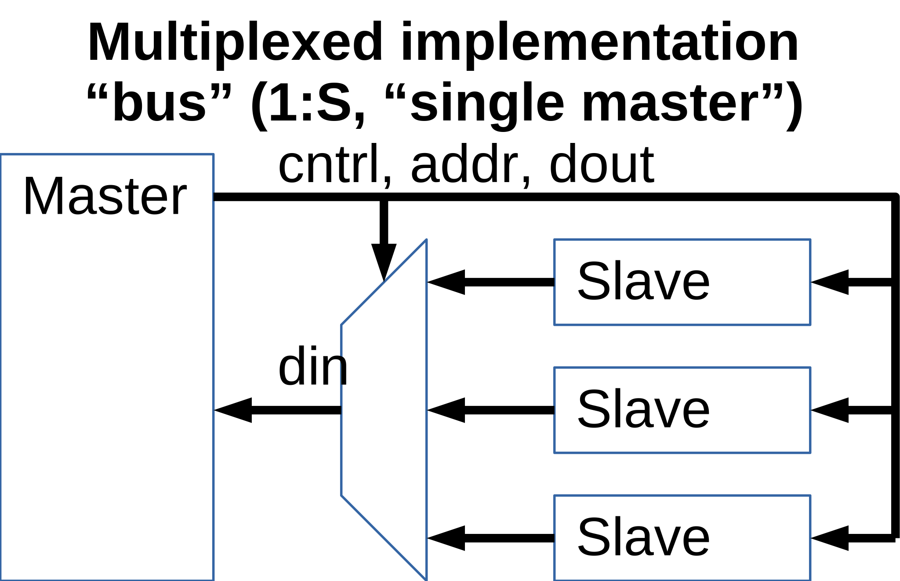
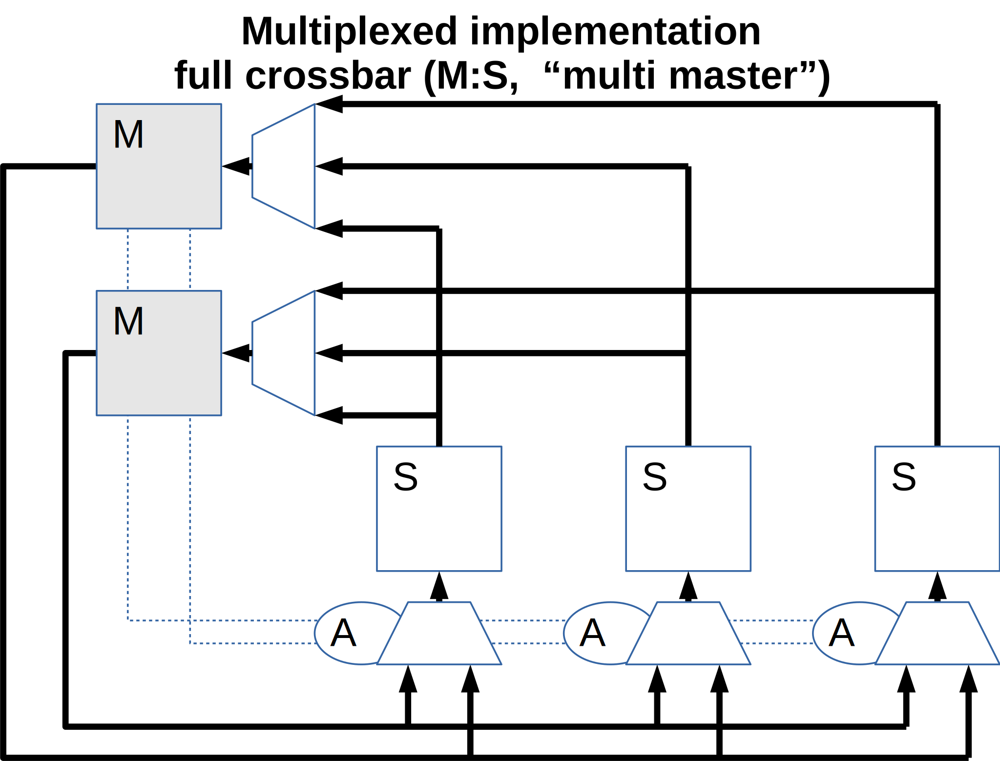

---
## **Implementation: Flat address decoding**
* every module places its registers at absolut addresses in total address space
* (unnecessary) high delay & gate count
* non existent orthogonality

---
## **Impl.: Hierarchical address decoding**
* every module  places its registers relative to address 0, i.e. it  only decodes the **lowermost** address bits **used by itself**
* a further signal indicates a module access

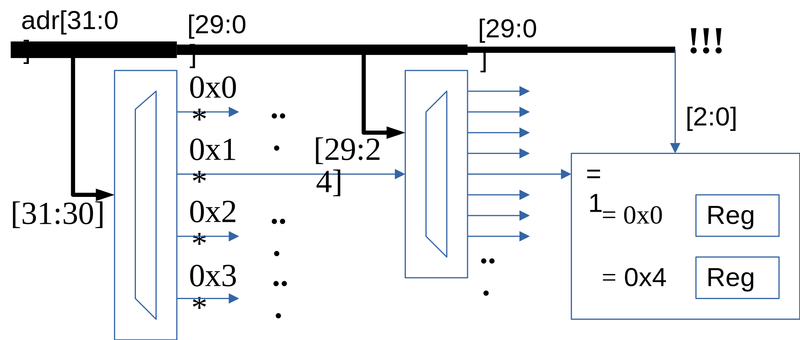
