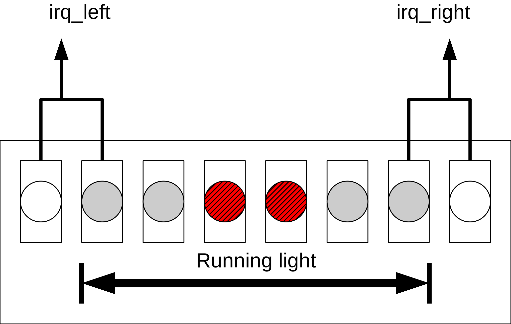

.. _ex5:

Ex.5: Hierarchical buses and cascaded interrupts
================================================

The functionality implemented in :ref:`ex3` with “polling” software should now be realized with interrupts, thereby dramatically reducing the CPU load. This requires two new hardware modules: A secondary interrupt controller and a bus multiplexer. These two modules should be designed to be flexible to allow them to be reused later on in your own project. The integration of these two modules with the running light and the TL-UL Host forms the (extensible) top level for your own project.

    The toplevel for your project created in this exercise.

Objectives
----------

- create hierarchical interconnects for TL-UL
- cascaded IRQs: apply architectures of peripheral modules and interrupt controllers
- work as a team

Preparation
-----------

* read the chapter "Exceptions and Interrupts" in the "Ibex Reference Guide" from the Ibex Documentation linked on the :ref:`resources` page.
* look up the CSRs used in *rvlab/src/sw/crt0.S* and *rvlab/src/sw/include/regaccess.h* in the "RISC-V Instruction Set Manual Vol. II: Privileged ISA", in the chapter "Machine-Level ISA" linked on the :ref:`resources` page.

Tasks
-----

**1. Project top level**

This exercise should be solved in a "top down" approach so your team members can work in parallel on tasks 2-4.

Start with modifying *student.sv* to create the structure as shown in the diagram above. You need to define the (extensible) interfaces for the TL-UL 1:N multiplexer and IRQ controller.  Once your group has agreed on the interfaces and created the student top level it can start working in parallel on tasks 2 and 3.

**2. 1:N bus multiplexer for TL-UL**

Implementation guidelines

- support TL-UL
- module name: "student_tlul_mux.sv"
- the interface must use the structs defined in the package tlul_pkg (*rvlab/src/rtl/tlul/pkg/tlul_pkg.sv*)
- the number of devices (1-16) must be configurable by a parameter
- the module must be **purely combinational**, i.e. do not use any flip flops
- Hierarchical address decoding: The address range of the *tl_device_peri* TL-UL port of the student module is defined by the main TL-UL xbar in conjunction with the peripheral TL-UL xbar. Please refer to *rvlab/src/design/tlgen/xbar_main.hjson* and *rvlab/src/design/tlgen/xbar_peri.hjson* for the resulting address range (or look into :ref:`memorymap`). Your student_tlul_mux should divide this address range into 16 equally sized ranges for the (up to) 16 connected TL-UL devices. For this **your student_tlul_mux must only evaluate (decode) 4 adress bits**.

Test your multiplexer with the provided test bench *student_tlul_mux_tb.sv* before integrating it into *student.sv*::

  flow student_tlul_mux_tb.sim_rtl_questa

After integration into rvlab adapt the base address definitions in *src/sw/include/rvlab.h* and use software to test the access for the running light and the TL-UL host.

**3. IRQ controller: hardware**

Design an interrupt controller based on the principles presented in the exercise. It should aggregate 1-32 incoming interrupt lines in any imaginable configuration to the outgoing interrupt line. The number of incoming interrupt lines should be made configurable at compile time using the parameter IRQ_MAX. The interrupt controller should have the following register interface:

======= ====  ========  =============================================================================
address mode  name      description
======= ====  ========  =============================================================================
0x00    r/w   all_en    0: suppresses all outgoing interrupt requests
0x04    r/w   mask      mask(n) = 1 <=> irq(n) enabled
0x08    w     mask_set  mask_set(n) = 1 <=> set bit n in mask
0x0C    w     mask_clr  mask_clr(n) = 1 <=> clear bit n in mask
0x10    r     status    status(n) = 1 <=> irq(n) is asserted
0x14    r     irq_no    n < IRQ_MAX: irq_no = n, irq(n) = 1 and there is no m < n with irq(m) = 1 and mask(m) = 1. 
                        n = IRQ_MAX: no pending unmasked irq
0x18    r/w   test      0: regular operation; 1: all irq inputs are wired to the test_irq register
0x1C    r/w   test_irq  see test
======= ====  ========  =============================================================================

Note: If the irq controller is finished before the TL-UL multiplexer, temporarily implement the later as a 1:1 connection between its input and (only) the output to the irq controller.  

**4. Interrupt controller: HAL**

Write a HAL (*student_irq_ctrl.c/h*) which isolates all accesses to the registers of the interrupt controller. These functions are time-critical as they are often used inside an interrupt handler. Therefore they should either be declared as extern __inline__ or even better be implemented as macros. In both cases the C header file has to contain not only the declarations but also the implementations.

**5. Interrupt handler**

Implement the top level interrupt handlers *student_irq_ctrl_top_handler()* with branches to the appropriate handlers depending on the value of the register irq_no. Implement these branches with a jump table (in ANSI C: array of function pointers). Provide functions *student_irq_ctrl_get(...)* and *student_irq_ctrl_set(...)* to read and write those tables during run time. These tables should be initialized with “dummy” functions during load time, i.e. before any program execution starts. Refer to *rvlab/src/sw/test_irq/main.c* for a simple example of an irq handler.

**5. Software driven test of all components**

Test your interrupt controller and the associated HAL thoroughly. A single incongruity can lead to errors in your project which are almost impossible to find.

Some of the sensible test cases:

- Does an interrupt request appear simultaneously, after exactly one clock cycle, at the irq_out output as well as in all status and no registers ?
- Do all prioritization circuits work correctly ? Test at least the following pattern sequence: irq[31:0] = 0, 100...0, 110...0, ..., 111...11, 111...110, 111...100, ... ,0.
- Does the mask register suppress the interrupt lines correctly ? Assert all interrupt lines and write a sequence similar to the one above to the mask registers.

Those test cases are best stimulated with a small C program which has direct control over all interrupt lines during a test mode. Implement this test mode with two additional registers accessible by the CPU: A 32 bit test register to stimulate the interrupt lines and a 1 bit register controlling a multiplexer switching the interrupt lines either to the test register or to their regular sources. Obviously interrupts have to be disabled in the RISC-V CPU during these tests.

**6. Interrupt controlled running light**

The functionality of the running light should be exactly the same as in :ref:`ex3`. However now all processing should take place in interrupt handlers. In the remaining time the CPU should compute something else, i.e. stay in an endless loop in the main program (e.g. while(1);) . Simply "or" the two outermost LEDs on each side to generate the interrupts, i.e. irq_left is active as long as at least one of the two outermost left LEDs is switched on.

Deliverables
------------

All deliverables should be submitted in a single PDF file.

**1. Questions**

#. of 2: How big (in kB) is the address range for each of the 16 TL-UL devices inside your student module ?
#. of 2: Which address bits did your 1:N bus multiplexer decode ?
#. of 6: How many cycles pass after one of the outermost gray LEDs light up until the application writes to the mode register ?
#. of 6: Which problems occur in the specified implementation when the change frequency of the running light is too high ? How would a more robust (maybe even elegant?) solution would look like ? Of course the running light itself may be modified as well.
#. Adding IRQ support to the memcpy bus master. How would the IRQ signal be generated ? Which basic steps would the IRQ handler perform ?

**2. Source texts**

#. Verilog of your 1:N bus multiplexer and TL-UL irq controller (excluding any generated code)
#. HTML of the IRQ controller's CPU accessible registers
#. C of the irq controller’s HAL
#. C of the irq table modification functions
#. C of the irq handler and your running light IRQ handlers

**3. Wave Views**

The wave views should be zoomed in as much as possible to only show the sections specified below. They should contain at least the clk signal, the irq output and TL-UL interface of student.sv, the LEDs, and the mode register of the running light.

#. Interrupt controlled running light: View showing the lighting up of an outermost "Grey" LED and the subsequent write access of the interrupt handler to the mode register.