# **RISC-V Lab**
# Ex4: Interrrupts

---
# **Content**
1. System level 
2. IRQ controller
3. Peripherals
4. ANSI C for IRQs

---
# **System level**
Basic Problem: (Some of the) real world act as **master** for the CPU.

(low end) examples
* audio: Fs=48kHz @ 100 MHz => ~2000 cycles / sample
* uart: 1 MBit @ 100 MHz => ~800 cycles / byte

Assumption: FIFO of length =1 (minimal latency)

---
## **System Level: Polling**

* CPU efficiency vs. latency
  e.g. 100 cycles per task switch 
   @ 5% of CPU cycles & 10 tasks
  => polling frequency: 20000 cycles
* even if latency is acceptable huge HW FIFOs required

=> even 0.2$ µC have IRQs
=> IRQs must for SOCs

---
## **System Level: Polling - for hard real time**
* processes split (long) sequences into FSMs (big case)
  -> easy to determine longest path through each process
  -> no concurrent processes influence the run time
  -> easily *provable* maximum reaction time
* example: Programmable Logic Control (German: "SPS")
```C
while {
   process1(...);
   process2(...);
   while (NOW() < time) {}; // burn remaining time of this cycle
   time = time + CYCLE_TIME;
}
```
---
## **System Level: IRQ driven**


* higher CPU efficiency
  processes requiring input sleep
* smaller response times
  * best (highest prio, nested): HW
  * best (highest prio, non nested):
    longest IRQ handler + HW
  * worst: never
* IRQ types
  * vectored (address for each IRQ)  
  * prioritized
  * nested / incorruptible IRQs

---
## **System Level: Level IRQ protocol**

Semantic: irqN = 1 <=> periphery module N requires the CPU

When the CPU is not required any more (regardless if the initial cause has been handled with or just gone away), the periphery module deasserts its IRQ line.

---
## **System Level: Edge IRQ protocol**
Semantic: irqN rising <=> exactly now periphery N requires the CPU
Issues
* periphery module can not take IRQ requests back  
* IRQs have to be stored in the Interrupt controller (IC)
  => handle & clear can not be atomic: new IRQ can occur in between  
  => shadow ("pending") register in IC  
* what happens with (multiple) IRQ requests during IRQs ? 
  Save or even count and execute afterwards ?
  Example: timer (clock vs. measurement)
<style scoped>
h1 {
  color: red;
}
</style>

=> IC makes decisions for the peripherals, which due to lack of information it can not always do correctly or efficiently

---
# **IRQ controller**


---
## **IRQ controller: irq_no**

* irqs over all peripherals >> vectorized irqs
* accelerates SW emulation of vectored IRQs (vs. count leading 0)
```C      
// linear vs. constant effort
Interrupt_Handler() {
  if (status & irq0_mask) irq0_handler()
  if (stat<style scoped>
h1 {
  color: red;
}
</style>
us & irq1_mask) irq1_handler()
  ...
}

Interrupt_Handler() {
  while (irq_no != NONE) { // loop reduces overhead for multiple pending IRQs
    jump ( jump_table[irg_no] )
  }
}
```

---
## **IRQ controller: all_en**
* single atomic instruction disables all irqs without side effects
* alternatives
  - CPU build in IRQ disable 
  - SW interlock (e.g. via "test & set command") - overhead too large

## **IRQ controller: mask set/clr**
* allows enabling / disabling of IRQs without disabling IRQs

---
## **IRQ ctrl: hierarchical**

* "IRQ controller" same for aggregation and in peripheral
* top level  "IRQ controller" can be different (PLIC)

---
# **Peripherals with IRQ: "no" FIFO**

* di / do is where two masters meet !
* (actually: FIFO of length=1)

---
## **Peripherals with IRQ: with FIFO**


---
## **Peripherals with IRQ: data & control flow**


**NEVER SPLITT HANDLING AND TAKING BACK OF AN IRQ**
  - couple the IRQ to the state
  - explicit clear only for (error) events or event counters ("acknowledge" = reading = clearing is the change of state)

---
# **ANSI C for IRQs**

```C
// Function pointer
void HelloWorld() { printf("Hello World\n") ; }
void (*p)();  // pointer to a function returning void

p = HelloWorld ;
(*p)();// call the function pointed to by p
p();   // same as above, abbreviation in ANSI C

// Array of array of pointers to functions returning void
void (*funarray[3])() = {c,b,c}  // pre init to c() b() c()

funarray[0] = a ;
(*funarray[0])() ; // do a();
funarray[1]() ;    // do b();
```

---
<style scoped>
p {  
  font-size: 20pt;
}
</style>
## **Appendix: X vs. IRQs**
"The worse case latency for a fast interrupt (FIQ) on an ARM946E-S processor occurs when the FIQ is signalled immediately after a ‘Load Multiple” instruction (LDM) of 16 words has started.
The ARM946E-S processor can not abandon this instruction, or process the interrupt until it completes. The 10 words may span 3 cache lines (which are 8 words each), causing 24 words to be loaded over the AMBA AHB bus. Additionally, each cache line may contain dirty data in both halves, requiring these lines (24 words) to be written back to memory. If the write buffer is full this must also be drained, requiring a further 8 AHB writes. The final load may cause a data abort, which adds a further 3 cycles to the response time. Assuming a 2:1 core to AMBA AHB clock ratio this will take 118 cycles, even with zero wait state memory.
Although these conditions are unlikely to occur frequently, a real-time system must allow for this worst case. Even if the maximum load multiple is limited to 4 words, we assume no external aborts, only half the cache lines being dirty and the write buffer only being half full, the latency will be around 60 cycles. As most of these cycles involve bus accesses, any wait states introduced by the memory system will increase this latency considerably."

from Peter Lewin: "Cortex-R4 A comparison with the ARM9E processor family" ©ARM

**Suggest improvements ! **