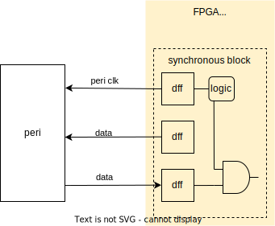
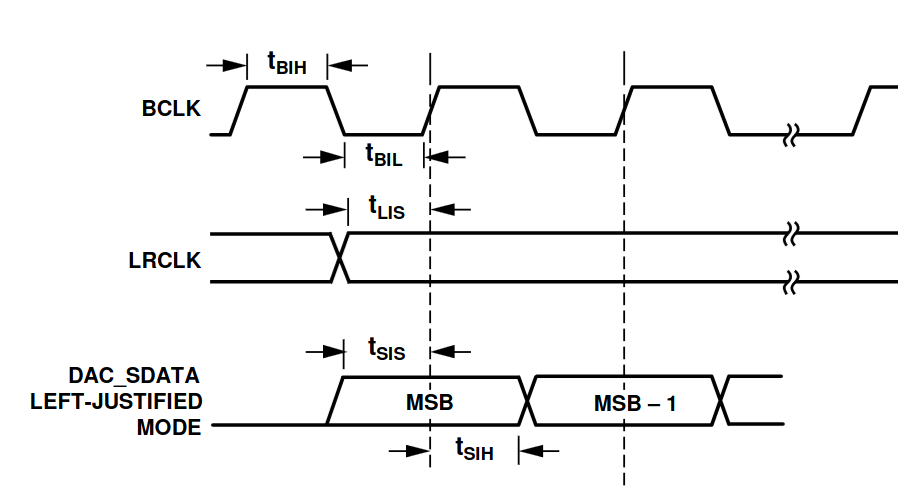
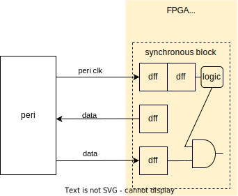
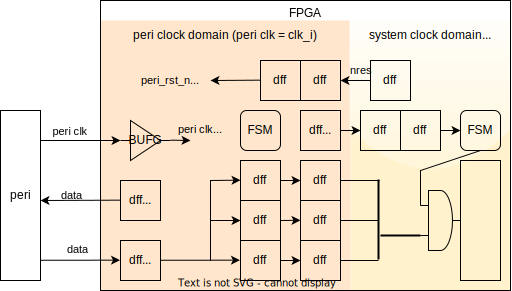
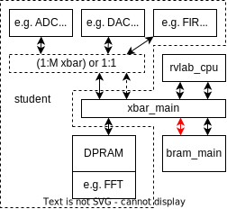

# **RISC-V Lab**
# Ex6: Specification

---
# **Content**
1. Project building blocks
2. Project Ideas
3. Project Flow
4. Project Specification
5. C Traps & Pitfalls

---
# **Project building blocks: Nexsys Video**
* HDMI video in/out
* audio stereo in/out
* 100/1000M Ethernet
* USB 2 (uart, parallel/SPI, PS/2)
* OLED display 128x32, 8 LED, 8 DIP
* sdcard
* connectors for extension PCBs
  * 4x PMOD = 4*8 IOs (3.3V)
  * FMC LPC (lots of IOs)
* ... (see "Design Reference")

---
## **Project building blocks: HW**
- Interfaces: I2C, SPI, PCM Highway, I2S (audio), MIDI 
- ICs: ADCs / DACs, h drivers, Irda ...
- HDMI camera (in lab: 1920x1080, 60 fps)
- RGB cameras (OV7670) & displays
- **modules from Aliexpress, ebay**
  - e.g. 64 x 64 RGB Led matrix (12288 LEDs!)
- historic: disk drives, PS2 keyboard & mouse, ...
- mechanics: modell servos (PWM), stepper/DC motors, ...

---
## **Project building blocks: IP cores**

- OpenTitan: TL-UL peripherals
- Opencores.org: Interfaces (USB, Ethernet), ALUs, 8/16bit CPUs, ...
- Pulp Platform: AXI & logarithmic interconnects, peripherals, ....
- more RISC-V CPUs: OpenHW, T-Head Semi (Alibaba), Chips Alliance (Western Digital), picorv32, FEMTORV32
- LiteX (Python!), SpinalHDL(VexRiscV)
- Special: Spiral FFT, fpganes, 
<!-- - Gaiser research (extremely high quality but VHDL / AHBL) -->
Make sure the **testbench of the IP works** *before* planing its use!

---
# **Project Ideas**
* class A ("really interesting")
  - require HW / SW codesign
    - real time requirements  => HW
    - high computational throughput => HW
    - high complexity, flexibility => SW
  - not possible with µC
  - (beat PC - difficult!)
* class B: use throughput of FPGA
* class C: build (smart, DMA) µC peripherals

---
## **Project Ideas: A**
- **Multi core network: standard CPUs or specialized cores**
ray tracer, particle simulator, fractals, neural networks...
- **Video real time processing**
"play" tetris, lollipop tracking, TV ambient light, edge extraction, ...
- **Game / Demo: Graphics card  (+ sound)**
3d demo, (new: Doom), ...
triangle shader (3D pipeline!), 2D: fill, line, circle, sprites
- **Audio low latency processing** 
hall or mouse effect, sound 2 disc drives, sound 2 midi,morse decoder, spectrum analyzer
time  (massively parallel FIR or IIR) or frequency domain (FFT)

---
## **Project Ideas: A**
- **Real Time Ethernet - process Ethernet frames on the fly**
e.g. Ethercat like, TCP/IP man in the middle attack
- **Software Defined Radio / Modulated data transmission**
100MS/s DAC PCB /  data via laser pointer
- **malloc() in parallel HW**
- **Emulator: VHDL boy** (new: nesfpga, amiga, ...)
- **Rotary display**
  string of 32 leds on custom PCB + motor + slip rings
- **Laser beamer (very difficult mechanics!)**
  laser printer motors & mirrors (good) / stepper motors (bad)

---
## **Project Ideas: new A**
* **"Nexsys Video" peripherals: HDMI in & out, ADAU1761, ETH**
* multi core real time processing (graphics card, audio, network?)
* (P4?) Ethernet switch - build FMC card with e.g. 3x ETH
* minimal 3d pipeline (must know algorithms before)
* real time use of DDR3 (e.g. as video memory)
* LARGE core (T-Head C910, Rocket, ...)
* SW defined multi phase DCDC converter (custom PCB)
* RVLAB
  - switch to open source: DDR3, Verilator, F4PGA
  - port to different FPGA/PCB (e.g. Tang Nano 20k)

---
## **Project Ideas: B**
- encryper / decrypter (DES / AES / ChaCha + IO (can be A)
- bitcoin miner, TROIKA Hash
- logic analyzer/ mixed signal oscilloscope
- multi axis robot control ("spider" walking with 18 servos)S
---
# **Partitioning**
Criteria
* functionality: manage complexity „divide and conquer“
* performance: latency and throughput
* timing, resource sharing, ...


Main issue: complexity => main principle: **Orthogonality**
* single, clearly defined task per module
* **independence** of all other modules

Test: How many parts need to be changed if functionality X is added or the environment changes ?

---
# **Interfaces**
- simple, easy to understand (optimal: state less)
- hide implementation

**Applied to HW design**
* TL-UL is standardized and visible => use for communication between independent peripherals
* preference
  1. CPU<->peri or peri<->RAM (DMA)
  2. peri to peri over "register bus" (ex1.) or TL-UL
  3. proprietary connection between modules

---
* CPU is always master!
  At any time the CPU can set a module into a defined states (e.g.off)

* consistent register structure
  - across register bits, registers within a module and modules
  - sequence of the (bits, registers)
  - names (= semantics of the registers and bits)
  - right aligned, zero padded, ...
  - leave place for extensions (between register bits, registers and modules)

---
* internal module register readable for debug (e.g. state registers). 
May not be used during normal operation. Ban from normal HAL, if possible make them only visible in a debug mode.

* advanced ("real" SoC)
  - individual gated clk for every module for power saving
  - individual nreset for every module
  - ...

---
# **Basic Architectures**
## **Using (any) peripheral**
1. Read the "Nexys Video Reference Manual"
2. Read the IC's data sheet, esp. the timing diagram (s/h times!)
3. Search the net for examples: Verilog, Arduino libraries, ...

---
## **Interfacing "slow" peripherals**

1. peri IO synchronous to clk from FPGA
   AND f(peripheral clock) <= 2x f(fpga internal 
   e.g. I2S, xSPI, OLED, ...
   => FPGA knows when its inputs are valid

2. peri IO synchronous to clk from peri
  AND f(peripheral clock) < ~4x f(fpga internal clock)
  => FPGA needs to sample peri clk to know when its inputs are valid
  
=> use design running *only* on fpga internal clock
   (basically same as lauflicht)


---
### **"slow" peripherals (1)**


* Ex: ADAU1761 @ fs=25/512=48.828
  bclk=25/512*64=3.125 MHz  
* all IO directly from/to dFF !
* unmask inputs only when valid !
  (input DFFs are X most of the time)



---
### **"slow" peripherals (2)**


* "input synchronizer" for peri clk
  * 1..2 clk cycles delay
  * "detects" when peri clk rises / falls
  * outputs decides when to
    unmask FPGA inputs / set outputs
* all IO directly from/to FF !
* unmask inputs only when valid !
  (input DFFs are X most of the time)

---
## **"Fast" peripherals**
* f(peripheral clock) > 0.5 f(fpga internal)
* e.g. Ethernet (GMII), RGB camera, HDMI

=> new clock domain in FPGA:
  * instantiate BUFG to drive clk of new domain
  * synchronize nres (opt: add BUFG to drive nres of new domain)
  * add clock constraints to XDC (frequency, false paths)
  * add clock crossings to "rest" of design

---
### **"Fast" peripherals: streaming**



---
### **"Fast" peripherals: (frame) buffer**



---
## **Architecture: Global DMA**

* route data / processing via xbar_main
* CPU needs to access data
* large external memory used
* reuse of internal memory

---
## **Architecture: Local DMA**

* bandwidth of SRAM limits performance -> multiple
* dedicated TU-UL xbar or SW conrolled SRAM MUX

---
## **Arch: Multi core**

##### "interconnect" = 1:N (TL-UL)
* map SRAMs of cores into global address map
* 50% of SRAM bandwidth lost
* routing & area limits number of cores
* timing/latency limits BW 4 Ibex
* f(core) >> f(system)

---
## **Arch: Multi core**

##### "interconnect" = sparse
* indirect access to SRAM of cores via "interconnect"
* ring -> many cores (but high latency, BW/N)    
* 2D, 3D matrix -> routing
* log network (!)
* ...
* f(core) >> f(system)

---
## **Arch: Multi core**


Using both ports for each core still possible.

---
# **C Traps & Pitfalls**
```C
// find the bugs (at least one error per paragraph):

y = x/*p;	/* p points at the divisor */

struct {
  int age; char *name;
} limits[] = {
  001, "baby",
  012, "teenager",
  100, "grandfather"
};

y = x<<4 + y ;	  /* y = x*2^4 + y */

i = 0 ;
while (i < n)
  y[i++] = x[i] ;
```

---
## **C Traps & Pitfalls**
```C
if (n<2)
  return
    longrec.date = x[0] ;
    longrec.time = x[1] ;


if (x = 0) // wrong
  if (0 == y)
    error();
  else {
    z = x / y;
  }
```

---
## **C Traps & Pitfalls**
```C
#define abs(x) x>0?x:-x
y = abs(a)-1 // wrong
y = abs(a-b) // wrong

#define abs(x) (((x)>=0)?(x):-(x))
y = abs(x[i++]) // still wrong

#define assert(e) if(!(e)) assert_error(__FILE__,__LINE__)
if (x > 0 && y > 0)
  assert(x > y);
else
  assert(y > x);
```
from: Andrew Koenig: C Traps und Pitfalls, Addison-Wesley
The book is recommended reading !