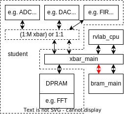
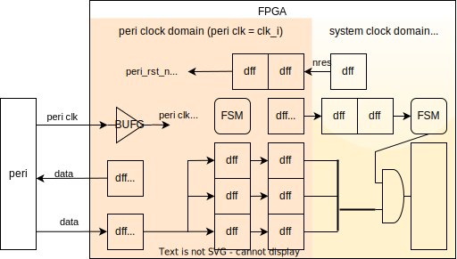

# **RISC-V Lab**
# Ex7: Architectures
# Mid term Presentation(s)

---
# **Content**
1. Application specific Architectures
2. Interfacing External Hardware
3. Mid Term presentation

---
# **Application specific Architectures**
## **Global DMA**

* route data / processing via xbar_main
* CPU needs to access data
* large external memory used
* reuse of internal memory

---
## **ASA: Local DMA**

* bandwidth of SRAM limits performance -> multiple
* dedicated TU-UL xbar or SW conrolled SRAM MUX

---
## **ASA: Few Multi core**

##### "interconnect" = 1:N (TL-UL)
* map SRAMs of cores into global address map
* 50% of SRAM bandwidth lost
* routing & area limits number of cores
* timing/latency limits BW 4 Ibex
* f(core) >> f(system)

---
## **ASA: Multi core**

##### "interconnect" = sparse
* indirect access of SRAM of cores via "interconnect"
* ring -> many cores (high latency, BW/N)
  e.g. for SRAM preload
* log network
  e.g. for jobs & results
* 2D, 3D matrix -> routing issues
* ...
* f(core) >> f(system)

---
## **Arch: Multi core**

Using both ports for each core still possible.

---
# **Interfacing External Hardware**
## **External HW: Basics**
1. Read the "Nexys Video Reference Manual"
2. Read the IC's data sheet, esp. the timing diagram (s/h times!)
3. Search the net for examples: Verilog, Arduino libraries, ...

---
## **Peripheral 4 "slow" external HW**

1. peri IO synchronous to clk from FPGA
   AND f(peripheral clock) <= 2x f(fpga internal 
   e.g. I2S, xSPI, OLED, ...
   => FPGA knows when its inputs are valid

2. peri IO synchronous to clk from peri
  AND f(peripheral clock) < ~4x f(fpga internal clock)
  => FPGA needs to sample peri clk to know when its inputs are valid
  
=> use design running *only* on fpga internal clock
   (basically same as lauflicht)

---
### **"slow" external HW (1)**

* Ex: ADAU1761 @ fs=25/512=48.828
  bclk=25/512*64=3.125 MHz  
* all IO directly from/to dFF !
* unmask inputs only when valid !
  (input DFFs are X most of the time)

---
### **"slow" external HW (2)**

* "input synchronizer" for peri clk
  * 1..2 clk cycles delay
  * "detects" when peri clk rises / falls
  * outputs decides when to
    unmask FPGA inputs / set outputs
* all IO directly from/to FF !
* unmask inputs only when valid !
  (input DFFs are X most of the time)

---
## **"Fast" peripherals**
* f(peripheral clock) > 0.5 f(fpga internal)
* e.g. Ethernet (GMII), RGB camera, HDMI

=> new clock domain in FPGA:
  * instantiate BUFG to drive clk of new domain
  * synchronize nres (opt: add BUFG to drive nres of new domain)
  * add clock constraints to XDC (frequency, false paths)
  * add clock crossings to "rest" of design

---
### **"Fast" peripherals: streaming**

---
### **"Fast" peripherals: (frame) buffer**

---
# **Mid term presentation**
* strict time limit: 6min per group + 2min for questions
  => FEW (<6) slides &  pictures & diagrams & (ultra brief texts)
* all team members must present
* aim / content
  * SELL your project
  * WHAT do you want to achieve (functional specification)
  * HOW do you plan to do it (architecture)

---
## **Mid term pres: Slide 0 - WHO**
* project name 
* list of group members

This is the only mandatory slide.
Following slides are example to give you ideas!
They can be omitted, changed etc.

---
## **Mid term presentation: Slide 1 - WHAT**
DONT: Copy bullet points from your functional spec.:
  - real time sound processing
  - 16bit @ 48kHz stereo audio in and out
  - 200k long FIR filter, latency < 5ms

DO: Create a **vision** and explain the **challenge**
  - hall effect generator (headline)
  - **pictures** of church and organ
  - **sound / video** file
  - **challenges**: very long FIR filter (200k for church)
    @ short latency (5ms for organist)
    
---
## **Mid term presentation: Slide 2 - HOW**

* Hardware top level block diagram  (MOST important picture)
* (re) use it to explain
  - environment (I/O)
    e.g. diagram include speaker & mic symbols
    (if its shows nicely may additionally replace WHAT slide)
  - general data / event flow 
    e.g. add colored arrows to explain data / event flow
  - functional partitioning
    e.g. add highlight to individual module
  - ...

---
## **Mid term presentation: Slide 3..X - HOW**

* present interesting / remarkable architectural features, e.g.
  - flowchart for main algorithm e.g. ray tracing
  - networks connecting CPU arrays
  - DMA descriptors
  -  ...  
* explain major / interesting modules (architecture, functionality, register interface)

