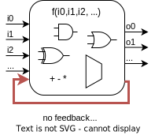

# **System Verilog for Synthesis**
# **Crash Course**

---
# **Content**
1. Requirements vs. Verilog
2. Modules
3. Data types
4. Combinational blocks
5. Sequential blocks
6. Find the bug
7. Advanced SV for synthesis

---
# **Requirements**

* describe synchronous logic
  * recap: advantages of digital design 
* be handled by all tools along the IC design flow:
  * linter
  * RTL simulator
  * formal verification
  * clock domain crossing (CDC) checkers
  * logic synthesis (two completely different tools for IC & FPGA)
  * logic equivalence check ("formal")

---
# **Verilog**

* THE industry standard
* created 1984 to write test benches (logic itself as schematic!) 
* 3x reinvented
  * 1995: synthesis (response to VHDL)
  * 2001: basic fixes: e.g. signed values (*still* no enum, struct,..)
  * 2005+: System Verilog (response to e): object orientation for test benches & essentials for HDL (& more dangerous stuff)

=> LEGACY, REDUNDANCY, PITFALLS, BUGGY dark corners
**=> small subset of SV usable  to describe HW** (rest of this slides)

---
# **Data types (HW only knows wires!)**

```verilog
logic [2:0] a;       // three bit wire
logic [31:0] b [3];  // array of 3 elements
enum logic[1:0] {idle=2'h0, swap=2'h1, count=2'h2} state;
typedef struct packed {
    logic [3:0] x;
    logic y;
  } xy_t;
xy_t xy;

// Use in within sequential block:
a <= 3'b111;
b[0][7:0] <= b[1][15:8];
state <= idle;
xy.x <= 4'd6;
```

---
# **Modules**
- `module`= encapsulated hardware block with inputs and outputs
- design structured by hierarchical instantiation

```verilog
module  #(
  parameter WIDTH = 8 // must be CONSTANT at instantiation
) (
  input logic clk_i,
  input logic rst_ni,
  input  tlul_pkg::tl_h2d_t tl_i,
  output tlul_pkg::tl_d2h_t tl_o,
  output logic [WIDTH-1:0] led_o
);
// put your instances & logic (always_comb/ff/assign/generate) here
endmodule
```
---
Instantiate module (always inside another module): 
```verilog
module .....
...
);
...
  student_rlight DUT #(
    .WIDTH(8)
  )
  (
    .clk_i (clk),
    .rst_ni(rst_n),
    .tl_i  (tl_h2d),
    .tl_o  (tl_d2h),
    .led_o (led)
  );
...
endmodule
```
---

# **Combinational blocks**


- describe combinational (=stateless) logic
- stateless: all LHS loose their value in between runs of the block
- `=`are executed in sequence (as in C)
- RTL simulates in "zero" (0ps) real time

```verilog
always_comb begin
  ovr = 1'b0; 
  mul = a*b;
  if (mul > MAX) begin
    ovr = 1'b1;
  end 
end
```

---

**Rules**
0. every LHS must appear in **exactly** one block 
1. every LHS must be set in **every** pass 
2. every LHS must be set **before** it is read in **every** pass
3. no feedback loops, also between blocks
4. only use blocking assignments (=)

**Info**
- TIP: set every LHS to a constant at the beginning at the block
- `always_comb`does *not* ensure combinational logic is synthesized, it is only a hint to the synthesis tool (which *may* report a warning if it generates something else) 

---
## **Operators for combinational logic**
- arithmetic: +  -  *  /  %
- (un)signed shift: << >> <<< >>>
- bit wise: ~ &  |  ^  (beware when using in if()!)
- logical: **! && ||** 
- relational: **==** != < <= > >=
- concatenation {n,m}
- multiplexers: if, case
- ?:

*most usefull list, not exhaustive*

---

# **Sequential blocks**


- describes D-FFs fed by combinational logic
- **all** LHS (outputs) are D-FF
- all `<=` triggering on one event are executed *simultaneously* (also between blocks)
- within a block: last `<=` wins

---
## **Sequential block example**

```verilog
always_ff @(posedge clk_i, negedge rst_ni) begin
  if (~rst_ni) begin 
    // EDIT START reset values
    acc  <= 32'h0000AFFE;
    // EDIT FINISH
  end else begin 
    // EDIT START
    if (op == MAC) begin
      acc <= acc + mul;
    end
    // EDIT FINISH
  end 
end 
```

---

**Rules**
0. every LHS must appear in **exactly** one block 
1. never use clk & nres anywere else (except module ports)
2. **every** LHS must be reset to a **single** **constant** (i.e. ONLY 0 or 1 allowed) value 
3. use non blocking assignments (<=)
4. only modify between EDIT START and EDIT FINISH 

**Info**
- `always_seq`does *not* ensure d flip flops are synthesized, it is only a hint to the synthesis tool (which *may* report a warning if it generates something else) 

---
# **Find the bugs**

```verilog
always_comb begin
  if (do_inv) begin
    b = ~a;
  end 
end
```

```verilog
always_comb begin
  i = i;
  if (do_inc) begin
    i = i + 1 ;
  end 
end
```

---
```verilog
always_comb begin
  o0 = in0 | o1;
  in3 = o0 & in1;
  o1 = in2 ^ in3;
end
```

---
```verilog
always_ff @(posedge clk_i, negedge rst_ni) begin
  if (~rst_ni) begin
    bclk <= start_val;
    i    <= long_period ? 2'b11 : 2'b10;
  end else begin 
    if (i==0) begin  
      blck <= ~blck;
      i    <= long_period ? 2'b11 : 2'b10;
    end else begin 
      i <= i - 1;
    end
  end
end 

always_ff @(posedge blck, negedge rst_ni) begin
  if (~rst_ni) begin
    o <= 1'b0
  end else begin
    o <= data[...]
    ...
  end
end 
```

---
## **Some more pitfalls**
-  "initialization" values ignored by synthesis `logic a = 1'b1;` 
  (use reset values for sequential signals instead)
- use `localparam`to define constants, not `const`

---
# **Advanded SV for synthesis**
(not covered here)
* loops (e.g. for) - are unrolled (replaces copy & paste)
* generate - create multiple instances (replaces copy & paste)
* (interfaces)
